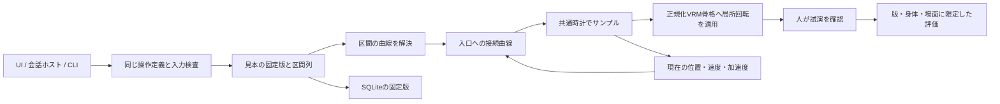

# V3：前提の再確認と設計判断

2026-09-08。目的は、良い動作を追加し、意味から呼び出し、区間を再利用して改善できること。旧版を動かすための接続層を作るのではなく、現在の目的に必要な一つの実行経路を作る。

## 確認した資料と実装

- [V1 README](../../v1/README.md)、[テスト方針](../../v1/docs/testing-policy.md)：対話・合成・固定版・局所修正・評価がある一方、事前計算器、画面、対話基盤などの責務が広い。
- [V2実装状況](../../V2/docs/implementation-status.md)：READMEには未実装と残るMCPや構成・歩行が、最新資料と実コードでは実装済み。READMEだけを現在の要件と見なさなかった。
- [見本を中心にした制作方針](../../V2/docs/example-first-motion-plan.md)、[接続モデル](../../V2/docs/curve-transition-learning.md)：専用制御器の調整から、見本の取り込み・意味・対話的構成へ優先順位が変わった。
- V2の `src/authoring.ts`、`src/motion/program.ts`、`src/mcp.ts`、VRM表示：知識グラフと専用動作の接続、複数の座標表現、身体補正が別々に存在する。
- [既存調査](../../research/natural-motion-report.md)：時刻の固定、協調の不足、切り出し端点を一律に静止と見なす問題が記録されている。調査当時のV2と現在のV2を混同せず、過去の数値をV3の合格基準へ流用しなかった。

## 採用・刷新・保留

| 旧版の前提・案 | 再確認したこと | V3での判断と代案 |
|---|---|---|
| 動作名ごとの専用生成器 | 見本追加のたびに生成器を書く必要はない | **刷新**。汎用の関節曲線クリップを正本にし、見本の追加はデータ登録で完了する |
| 知識グラフを先に整備 | 当面の制作に必要なのは意味・由来・区間と固定参照 | **再検討（2026-09-09）**。ユーザーの明示依頼により身体・概念・部品・派生のグラフと版付き定義を追加。実行の正本はClip/Scoreを維持。詳細は末尾 |
| 階層を維持して部品を再利用 | 使用箇所の独立編集と固定元の保持が重要 | **簡素化**。保存済み構成の追加時に区間列へ展開。再生時は見本への直接参照だけになり、循環・再帰予算・方法選択が不要 |
| 不変版・局所修正 | 共有部品を上書きすると他の作品と評価が変わる | **採用・再実装**。SQLiteの固定版、楽観的な版照合、使用箇所key。評価は新版へ引き継がない |
| 開始・終了は静止 | 見本の切り出し端点は運動中になり得る | **変更**。各端点で位置・速度・加速度を保持。停止が必要な時だけ制動区間を追加 |
| 切り替えは現在状態から直接計算 | 既存の休息姿勢・遷移クリップ経由は不要 | **採用・再実装**。始終端の6境界条件を持つ5次曲線。実行前に接続全体を検査し、失敗時は元の実行を保つ |
| 入口を自動決定 | 姿勢の近さだけでは意味上の準備・保持を省略できるか判断できない | **保留**。区間のfrom/toで入口を明示。全見本の再現と途中区間への接続を同じ形式で表す |
| 動作固有の肩・手先・衣服補正 | 見本そのものの品質と表示変換の問題が混ざる | **刷新**。同一の正規化VRM骨格の局所回転を直接適用。実行用の仮想身体、手先IK、衣服ウェイト書換えは持たない |
| 筋モデル・学習する接続モデル | 調整・採用した見本がまだ不足 | **保留**。まず再現可能な固定曲線と条件付き採用記録。学習済みであるかのような係数・ダミー更新を作らない |
| 歩行・任意体型・対象追従 | 全身化には接触、root移動、適応の意味・制約を同時に扱う必要がある | **保留**。今回の受入範囲は固定立位・上半身。足の移動を追加しながら接地を無視する中間実装は作らない |
| AIが数値フレームを作る | 意味の選択と毎フレームの運動計算は異なる責務 | **採用しない**。エージェントは登録・検索・区間選択・編集。フレームはローカルの共通曲線計算で作る |
| Codexログインを内部に持つ | ユーザーが主目的をキャラクター対話と明示 | **採用へ変更（2026-09-09）**。Codex app-serverをV3の専用クライアントから使う。認証情報はCodexが管理し、V3は保存しない。外部HTTP/CLI/stdio MCPも維持 |
| 自然さを数値だけで合格にする | 範囲・連続性の保証と主観的な採用は異なる | **採用しない**。数値検証と身体・場面・版付きの人の評価を別記録にする |
| V1/V2と同じ表示モデル | 比較対象を揃えれば、実行方式による違いを確認しやすい | **資産のみ採用**。元VRMをV3へ独立同梱。旧コード・DB・収録データへの実行時依存はない |

## 実行経路

`model.ts` が座標と形式、`curve.ts` が数式、`motion.ts` が区間の解決・共通時計・割り込み、`store.ts` が保存、`api.ts` が共通の操作定義。`server.ts` はHTTPと配信、`mcp.ts` と `cli.ts` はそのクライアント。`rig.ts` と `viewer.ts` は表示、`browser.ts` は編集画面。

構成を再生する別の専用実行器、操作方法のレジストリ、旧版形式のインポータ、グラフDB、汎用ワークフロー基盤は存在しない。初期見本の名前は実行器で分岐しない。

## 曲線と座標の選択

クリップの各チャンネルは `{t,p,v,a}` の列。隣接点の間は5次Hermite曲線で、速度・加速度は実時間微分。速度倍率をrにすると区間時間は1/r、速度はr、加速度はr²になる。

切り出した区間も元と同じ多項式の境界状態を使うので、区間の再構成で元曲線を再現できる。状態が一致する隣接区間には接続を挿入しない。ライブ開始時も入口と現在状態が一致すれば余分な待機を挿入しない。異なる状態の接続は現在状態から次の入口へ直接計算する。見本の末尾が運動中なら、止めるための区間を明示的に足す。デフォルトの一律休息姿勢への復帰はない。

回転は局所XYZ Euler座標の限定領域で扱う。クォータニオンの成分への加算や、最短経路を決めるだけの骨方向転送は使わない。座標が滑らかなら表示回転も滑らかになるが、Eulerの成分速度を世界角速度と同一視しない。角度の周回・任意リグへ拡張する段階で表現を見直す。数値のmin/maxは保守的な制作範囲であり、解剖学的な関節限界ではない。

区間内の位置極値は微分多項式の根から検査する。フレーム間の狭いオーバーシュートをサンプル検査だけで見落とさない。これで衝突・足接触力・衣服の自然さが保証されるわけではない。

## 当面の制約と見直す条件

当初の意味検索はタグと語の照合だった。2026-09-09の明示依頼で、概念辞書・別名・上位関係と部品の検索を追加した。実行の正本は維持する。未登録の意味や多義語の解決を完全な理解として扱わない。

同時実行は「右手を振りながらうなずく」という部位の重なり方を実例として再検討した。肩・肘・手首を腕の協調単位にし、所有が重ならない部品を作成時に一つのクリップへ合成する。実行時の競合調停器は追加しない。

接続失敗時の自動時間延長・自動入口変更もない。勝手にタイミングや意味を変えず、時間か区間の選び直しを返す。よりよい代案は、実際の採用・修正例で評価してから導入する。

技術依存の版は既存環境で動いているThree.js/VRMローダーを固定し、V3へ独立インストールした。旧版の実装互換性を維持するための選択ではなく、データ・実行器の変更を検証する際に表示ライブラリの変更を同時に混ぜないための選択。

## Ember実装（2026-09-09）

ユーザーがA案を選択。チャットを初期画面、ライブラリと上下ドックを補助編集画面にする。背景は同梱VRMとThree.jsの室内オブジェクトで描画し、提案画像を実モデルと偽って表示しない。

対話のより簡単な代案はブラウザーに入力だけ置くことだが、主目的を満たさないためCodex app-serverの実接続を採用。V1の実装を参考にプロトコルを確認したが、V3のCodex/Chatクラスで独立実装し、旧版モジュールへ依存しない。公式資料: https://learn.chatgpt.com/docs/app-server 。既存のChatGPT認証と利用可能モデル一覧を使い、APIキーへフォールバックしない。専用の一時スレッド、read-only sandbox、approvalPolicy=never、shell/apps/hooks/MCP/plugins/webを無効化した会話専用設定を使う。モデル出力は本文とカタログ内固定参照だけで、生成テキストから任意コマンドを実行しない。

会話履歴は同じSQLiteの独立テーブルに保存。重複requestIdと同一会話の並行送信を拒否し、中止後の遅延出力は再生しない。実行直前に固定参照を検証する。自然さの採用評価を自動生成しない。

軌跡編集は既存の局所XYZ角を正本に維持する。表示用に手先・頭位置へ順運動学で変換し、3Dドラッグの画面方向を選択中の1軸の微小変位に投影して角度を変更。画面にほぼ垂直な軸は上下ドラッグで角度を変更する。全身IK・自由なXYZ位置制約は導入していない。曲線の点は時刻と角度を編集し、端点時刻・順序・関節範囲を守る。元の速度と加速度を保持し、同じcompileの区間内極値検査に通る変更だけを反映する。

## 手の向きと表情の領域（2026-09-09）

実モデルの指骨格から、手首→中指の向きと小指→人差し指の向きの外積で手のひらの法線を求めた。右手は後者×前者、左手は符号を反転する。旧挨拶の1.4秒は掌法線(-0.569,-0.794,0.214)、旧紹介の1.1秒は(-0.134,-0.974,-0.184)。どちらも主に下を向き、ユーザーの指摘を再現した。

座標変換の全体反転は、休息姿勢・他の関節・編集済み曲線も変えるため採用しない。見本の回転配分を修正した。オフラインの骨格上でキー姿勢を検討し、通常のClipデータとして登録した。ランタイムに動作名ごとの制御器やIKはない。挨拶は掌+Z・指+Y、紹介は掌+Y・指はキャラクター自身の右を基準にした。左手版は同じ曲線を矢状面で鏡映し、実モデルの指骨格で左右を検証した。

旧リリースの定義は examples/starter-v1.json に保持。seedは内容が旧版と完全一致する同梱候補だけを新版化し、ユーザーの変更がある候補は自動更新しない。構成の固定参照も旧版を保持する。今回の依頼で確認した個別編集案2件は、独立した検証・更新スクリプトで新版を作成した。

表情は同梱VRMの既存モーフを使う。関節角と表情ウェイトは値の範囲・リグへの適用先・保持時間が異なるため、骨格プロファイルへ混在させず独立領域とした。同じサービス時計で顔の状態を生成し、SSEで表示へ渡す。切替は現在値から目標値への凸結合なので、割り込みでも重み合計が1を超えない。短い保持後に自然へ戻す。表情切替の位置値は連続だが、骨格用のC2接続保証を表情にもあるとは主張しない。

Chatの構造化出力に表情名と強さを追加し、登録済み6種類・0〜1をサーバーで検証してから表情と動作を開始する。履歴に表情を保存し、中止された遅延応答は表情にも反映しない。顔の試演ではbodyの保存版を変更しない。

## 意味と身体の知識・部品による制作（2026-09-09）

ユーザーが、旧V1の身体部位・動作オントロジーと、エージェントが意味から部品を探して新しい動作を作る機能の導入を明示した。V1の`character-behavior-ontology.md / behavior-graph-design.md / packages/motion/semantics.ts`を確認。そこに書かれた将来の目標駆動・IK・汎用計画を、すでに実装済みの能力として扱わなかった。

より簡単な代案はカタログへタグを増やすことだったが、部品の固定版、使用条件、派生元と再利用を表せない。現在のSQLiteへ不変の知識revisionを追加し、動作ID・版・ハッシュと結び付けた。オントロジーは小さな型付き辞書としてV3内に置き、グラフのノードと関係は保存定義から組み立てる。旧DBや旧実行器へのランタイム依存は追加しない。

意味検索は別名・上位概念・段階・部位で候補と理由を返す。関連概念は明示指定時だけ広げる。同梱の制作データと一致する版は準備・主動作・戻しを定義し、未知の曲線の段階は推測しない。身体の分解は体幹、頭と首、左右の腕と手。腕では肩から手首までを一組として扱う。

抽出は境界の位置・速度・加速度を保持し、順次合成は既存の接続曲線、同時合成は異なる関節チャンネルだけを重ねる。元の条件と部品の説明は派生候補へ保持する。結果を普通のClipへ変換するので、保存・再生・編集の経路は共通。条件のテキストは適用範囲の説明であり、汎用述語評価による意味成立の証明ではない。

会話エージェントには最大8判断の構造化要求ループを追加。検索、局所定義取得、派生の要求だけをホストが厳密に検証する。原則として検索結果の版を読み、条件をinspectしてからderiveする。最終選択した派生だけを新IDへ保存・試演する。任意コードや採用評価の生成は公開しない。新しい候補の返答・表情・固定参照・作成記録を会話とともに保持し、中止後の遅延応答を抑止する。

## 動作の途中停止と表示時計（2026-09-10）

カクつきの調査で、旧見本のtrackがほぼ全制御点にv=0,a=0を設定していたことを確認した。挨拶では同方向に進む途中の20点、案内では12点、驚きでは42点が各関節曲線で停止していた。首振りの8折り返し点も速度だけでなく加速度までゼロになり、毎回ゆっくり止まり直していた。C2連続であることと、途中停止がなく自然に流れることは異なる。

ポーズの位置・時刻・同値ポーズ間の保持を保ち、制作時の速度と加速度を再計算した。単調な通過点は隣接傾きから速度を求め、折り返しは速度0で適切な符号の加速度を残す。5次Bezierの制御点が区間の方向に並ぶよう加速度と速度を制限し、元の両端角度を超えない。処理は`authoring.ts`の見本制作だけに適用し、通常のランタイム曲線を平滑化して意味やタイミングを変える処理は追加しない。

配信は調査時、Windows上で約46〜48ms間隔だった。短い観測では通信途絶を確認しなかったが、旧ブラウザーは各受信時刻で表示時計を再設定するため、到着の揺れで時計が後退し得た。`playback-buffer.ts`は受信から独立した単調な表示時計を持ち、目標との差を速度0.85〜1.15倍で緩やかに調整する。80msの余裕を持ち、未受信の先へ外挿しない。サーバー時計のリセットは新しい系列として扱う。関節値そのものは既存の位置・速度・加速度の補間を使う。

旧見本データは`examples/starter-v2.json`に保持した。seedは旧リリースと完全一致する版だけを更新し、ユーザーの編集は自動上書きしない。今回調査した編集例と合成済みの挨拶は専用スクリプトで新版を作り、構成・派生は滑らかな固定元へ接続した。以前の会話からの再生は当時の固定版を保持する。

## 基本操作からの階層的な組み立てと情報開示（2026-09-10）

ユーザーが、V1のように基本操作から意味を付けて上位動作を繰り返し作ること、およびエージェントのカタログを関連候補のID・説明だけに絞ることを明示した。V1の`motion-composition.md`、`packages/motion/seeds.ts`、`apps/service/skill-retrieval.ts`を参照。従来の「必要になるまで階層を増やさない」に対し、今回の「下げる＋戻す→うなずき→二度うなずく返事」が必要性の具体例となる。

代案の一段合成だけでは同一会話で中間動作を使えず、再利用時に名前・意味・元部品を失う。新しい再帰実行DSLを導入する代わりに、従来のClipへ合成結果を焼き付け、derivationに各段の固定ref・知識revision・使用部品・配置を残す。実行は従来どおり平坦な曲線。意味と構成の階層は保存グラフに置き、inspectで一段ずつたどる。旧V1への実行依存や動作名別コントローラーは追加しない。

22種類の基本操作も共通クリップ。終了姿勢を保持し、復帰は別操作にした。順次合成は操作しない部位の直前終端を保持し、同時合成は所有競合と長さを検査する。出力は所有部位の和だけを持つため、中間動作を再利用しても無関係な腕や頭を占有しない。速度、開始姿勢を基準とする変位倍率、反復、順序を同じderiveで指定できる。速度合わせで同じ境界が浮動小数点誤差分だけ重なる場合は1ns未満だけ統合し、本来の短すぎる区間は従来の検査で拒否する。

会話内の中間案は要求ごとのメモリDBで作成し、最終案から到達するものだけを本DBへ一括保存する。作成途中の一時IDは保存時に固定IDへ置換し、親の部品キー・revisionを保つ。全保存を外側のトランザクションで囲み、保存・定義追加はsavepointで入れ子にした。最終保存が失敗すれば中間案も残らない。過去版、知識revision、採用記録を変更しない。

カタログは発言の意味・短い語で全最新版から検索し、最大8件・3,600 UTF-8バイト以内のkey/descriptionだけを返す。初期候補を追加検索結果で際限なく増やさない。追加検索も同じ軽量形式。定義取得後に構成・使用条件と編集ツールの仕様を渡し、数値はmotion-parametersで対象部品・チャンネル・ページを明示した場合だけ渡す。過去の発言は明示的な指示語の解決だけに使う。非関連の通常会話へ候補を埋めるフォールバックは作らない。

固定立位・上半身の範囲を維持。V1にあった手指操作・対象へのIKや汎用条件ソルバーまで実装済みと扱わない。各段の意味は制作意図であり、子の意味や人の評価を無条件で全体へ継承しない。

## Tailscale経由の接続（2026-09-10）

外出先から確認するという明示要求に対し、既存のTailscale Serveへ18443番のHTTPS転送を追加した。直接LANへバインドする代案を避け、V3のloopback待受を維持しつつ、設定ファイルの正確なHTTPS originだけを許可する。既存443番の転送は維持した。設定と検証は[tailscale.md](tailscale.md)に記載。HTTP境界テストを追加し、全29件が成功した。
# 意味付き操作と数値の管理（2026-09-10）

利用者は「腕を右にひねる＋角度や速度」のような管理を求めた。曲線の軸名だけを日本語化しても、腕の長軸まわりの回転とEuler軸の違い、方向基準、単位が曖昧なままなので、版付きの操作定義とパラメーターから通常クリップを生成する薄い制作層を採用した。動作ごとの実行器は追加しない。部位・骨への配分・回転方向は宣言データで、既存の検証・接続・再生・固定版保存・多段合成を共用する。

前腕／上腕のひねりは正規化骨格の局所長軸に沿うQuaternionの後乗算で計算し、既存XYZ Eulerの曲線へ変換する。同梱モデルの長軸は±Xから微小なずれがあるため、実骨格の掌角度と手首位置も数値検査する。頭・体幹・肘は定義した局所軸と骨への配分を使う。身体の右左と、根元から先を見る回転の右回り左回りを別の項目として公開した。

時間指定は片道時間または平均角速度の一方。停止端点を持つ五次の角度関数を使い、Quaternion→Euler変換の微分を反映してp/v/aを生成する。各片道を32区間に分け、既存の区間内極値検査も通す。単位は入力で度・秒、曲線でrad・秒。平均速度は加減速中の瞬間速度と区別する。開始姿勢は固定refと時刻を記録し、依存する生成部品は最終候補と原子的に保存する。

会話は操作の検索→定義取得→生成を要求し、定義を取得する前の生成と未確認の開始姿勢は拒否する。検索では最小のID・説明だけを返し、数値Schemaは定義取得後に開示する。保存時のsemanticは生成の由来であり、後の曲線編集との同値性は保証しない。UIもその値からの再生成であることを説明する。採用評価・衝突回避・任意体型への適応はこの機能の検証とは分ける。

## 検索失敗後の作成と通常会話（2026-09-11）

実履歴では「拍手してください」に検索0件・motion:nullのまま「拍手しますね」と返していた。原因は、カタログにない場合はnullという指示と、動作の必要性・実行結果を照合しないホストにあった。単語ごとに固定動作へ振り分ける代案は採らず、エージェントが文章・表情・身体動作の判断を構造化して返す方式にした。動作が必要ならその判断を検討中に保持し、0件や実行候補なしだけでは最終返答できない。基本部品を探し、必要な定義を読み、合成する。適用範囲の不足は調査後の未実行理由として扱い、約束だけを成功扱いしない。24判断の予算を越えても、実行できたという文を公開しない。

通常会話は初回の動作検索自体を行わず、文章のみの判断では生成・再生・表情変更をしない。表情だけ必要な判断は独立して残した。利用者への確認は試演の後であり、作成前の許可待ちを増やさない。生成候補を保存しても人の採用とはせず、再利用時もその固定版・身体・場面の記録を確認する。過去の実行refを短いassociatedMotionとして履歴へ付け、指示語を根拠なく別の動作に結び付けない。UIは作成中の進捗を読み取り、完了応答を古いpendingポーリングで上書きしない。

拍手の検証では両肘の曲げ戻しだけでは掌の間隔が約44cm残ったため、両手を胸の前に構える・近づける・離す・下ろすという汎用部品4件を追加した。完成した拍手を登録したり、拍手専用の実行器を追加したりせず、既存deriveで順番と反復を構成する。制作時のみ位置・向きへの数値フィッティングを用い、結果は通常の関節曲線データとして保存する。稼働中のIK・関節制御経路は増やさない。数値上の掌の接近と、自然な拍手に見えるかの人の判定は別に残す。

併せて、明示conceptsの一致だけで無関係なqueryまで一致したことになる検索条件を修正した。queryを指定した場合はquery自体の語・概念一致も必要で、conceptsは追加のAND条件となる。

## 動作中の表示倍率を固定（2026-09-11）

チャット画面は毎フレーム指先の位置から必要距離を計算してカメラを前後させていたため、拍手などの腕の開閉で人物と背景の倍率が変化していた。この追従処理を削除し、モード・視点の選択と利用者のカメラ操作で決めた位置を維持する。手を画面内に収めるための自動ズームは行わない。
